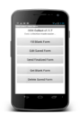

.. |BUILD| image:: docs/build.png
   :width: 50 px

Introducción
============

Presentación y objetivos
------------------------

La recolección de datos sobre el terreno es una tarea fundamental dentro de la acción humanitaria ya sea cuando se interviene en una emergencia o en un proyecto de desarrollo.

Tradicionalmente este trabajo se ha realizado rellenando a mano las encuestas y  tabulándolas posteriormente. Esta técnica es poco eficiente y son muy numerosas las posibles fuentes de error desde el momento de recoger la información hasta la publicación de los resultados.

Open Data Kit (ODK) es un conjunto de herramientas informáticas que permite sistematizar algunas de las tareas que intervienen en todo este proceso facilitando la realización de las encuestas a través de dispositivos móviles y el procesamiento de las mismas, disminuyendo en buena medida posibles errores.

Esta unidad pretende realizar una introducción a las diferentes  herramientas ODK, mostrar para qué sirven y las relaciones existentes entre las mismas. Posteriormente se introducirá la herramienta principal a través de la que se realizan las encuestas, denominada “odk collect” y que, en posteriores unidades, nos servirá para enlazar con el resto de herramientas.

De forma más concreta, los objetivos de esta unidad son:

- Conocer las diferentes herramientas que forman parte de ODK, para qué sirven y cómo se relacionan.

- Instalar en nuestro dispositivo móvil la aplicación Collect e iniciarnos en su uso.

Comocimientos previos y recursos
--------------------------------

Esta unidad requiere un conocimiento a nivel de usuario del sistema operativo Android, el sistema operativo más extendido para Smartphone y Tablet, así como estar familiarizado con el uso de navegadores de Internet. 

Como recursos adicionales hay que destacar el abundante y extenso material que puede encontrarse en Internet, que puede utilizarse para resolver dudas y ampliar conocimientos, destacando las siguientes páginas:

- Open Data Kit: https://opendatakit.org/

- Foro ODK: https://forum.opendatakit.org/

.. Attention:: ODK está en continuo proceso de desarrollo y mejora. Regístrate en el foro de ODK para estar al tanto de todas las novedades y poder interactuar con la comunidad de usuarios.

¿Qué es ODK?
------------

Open Data Kit (ODK) es un conjunto de Herramientas de código libre que ayuda a las organizaciones a crear, implementar y administrar soluciones de recopilación de datos móviles. 

Comenzó como un proyecto de Google.org, en abril de 2008 y los desarrolladores principales son investigadores del Departamento de Ciencias Computacionales e Ingeniería de la Universidad de Washington.

ODK nos permite realizar formularios en dispositivos móviles y enviar la información directamente al ordenador, sustituyendo el uso del papel y ahorrándonos horas de transcripción. Esto nos facilita obtener la información necesaria en un tiempo menor para dar una respuesta más rápida y eficaz.

Se pueden hacer muchos tipos de formularios aplicados a diferentes áreas:

- Registro de actividades, beneficiarios, pacientes, vehículos, puntos de agua, letrinas, préstamo de material, etc.
- Encuestas de evaluación y de satisfacción, etc.
- Evaluaciones en terreno, líneas de base, etc.

Estos formularios pueden recoger también imágenes, audios, vídeos, geolocalización, etc., facilitando la evaluación y la visibilidad de las operaciones con un único dispositivo.

Herramientas más utilizadas
---------------------------

Las herramientas más utilizadas son:

- |BUILD| Build: para crear un formulario de recopilación de datos o una encuesta.
- |COLLECT| Collect: permite reunir datos en un dispositivo móvil y enviarla a un servidor.
- |AGGREGATE| Aggregate: agrega los datos recogidos en un servidor y permite extraerlos en formatos útiles.

.. Attention::  Google Drive, el espacio de almacenamiento de Google en la nube, puede ser utilizado también como “servidor”, para obtener los formularios y recopilar la información. Es una opción más sencilla de implementar que Aggregate y, por eso, será abordada en primer lugar.

Comunicación entre herramientas
-------------------------------

Mientras que Build se comunica de forma unidireccional con Aggregate para enviarle los formularios en blanco, en cambio, la comunicación entre Collect y Aggregate es bidireccional: collect obtiene los formularios en blanco del servidor y los envía una vez se hayan rellenado.

.. figure:: 'docs/comunicacion.jpg'

Instalación de la aplicación ODK collect
----------------------------------------

A continuación vamos a realizar paso a paso la instalación de la aplicación ODK collect en nuestro Smartphone. 

Una vez en nuestro dispositivo vamos a Playstore donde se pueden buscar e instalar las aplicaciones para nuestro Smartphone.

......

